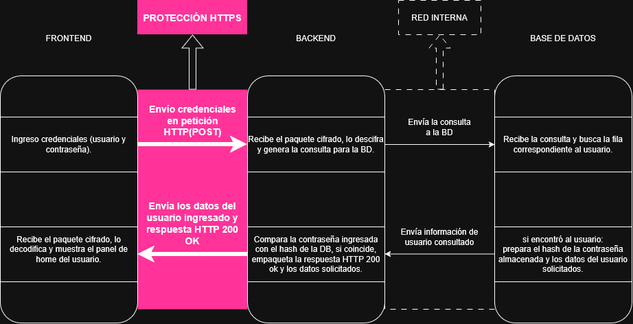

# Objetivo 1: Mapeo de Arquitectura Lógica

**Aplicación elegida:** Home Banking (Login de usuario)
En este caso, la protección HTTPS ocurre en el tramo de comunicación entre el frontend y el backend

---

## Diagrama de flujo

