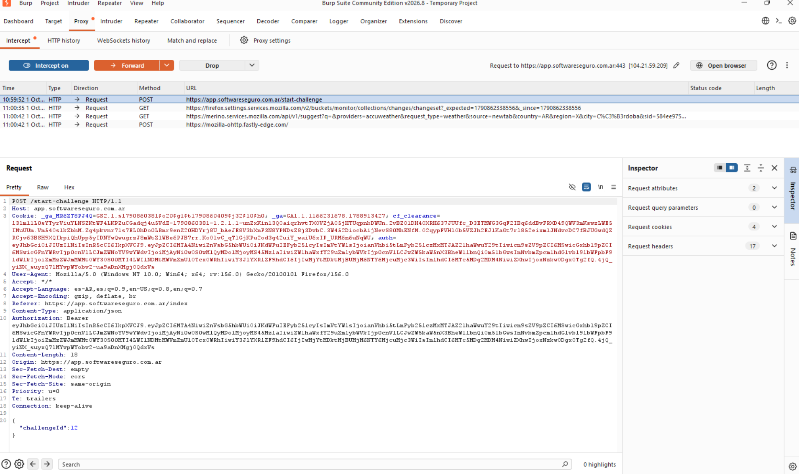

# Objetivo 4: Instalación de proxy

**Aplicación de muestra:** Votación

---

## ¿Qué es un Proxy?
Un proxy es un intermediario entre la computadora y el servidor web al que se quiere acceder. Muestra un panel con las peticiones que son enviadas a dicho servidor, dando la posibilidad de poder interceptarlas, leerlas o modificarlas en el camino.

---

# ¿Qué lo diferencia de una VPN?
Un proxy solo actúa sobre una cosa en específico, en cambio, la VPN afecta a absolutamente todo el tráfico del Sistema operativo. Además, un proxy sirve para interceptar o analizar paquetes, pero no garantiza de que el viaje sea encriptado. En cambio, la VPN crea un túnel fuertemente cifrado entra la computadora y el servidor de destino, ocultando el contenido.