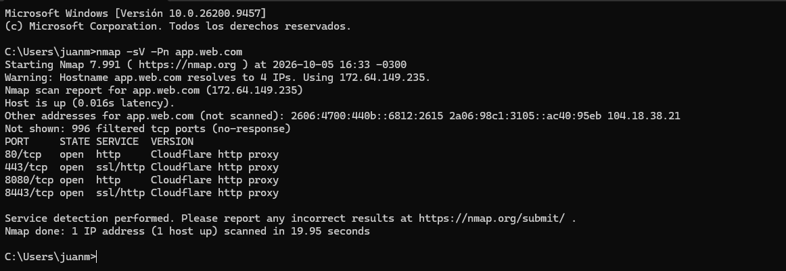

# Objetivo 2: Escaneo de Red (Nmap)

**Página escaneada:** `app.web.com` (Desde programa público de Bug Bounty).

**Comando Ejecutado:** `nmap -sV -Pn app.web.com`.
- sV: Indica exactamente el software y versión que se está ejecutando.
- Pn: Le indica a Nmap que el servidor está encendido.

**Descripción:**
- El escaneo muestra cuatro puertos TCP abiertos (80, 443, 8080, 8443)
- Todos ejecutan "Cloudflare http proxy", indicando el uso de Cloudflare como intermediario (WAF) para ocultar el servidor original.

**Captura:**
